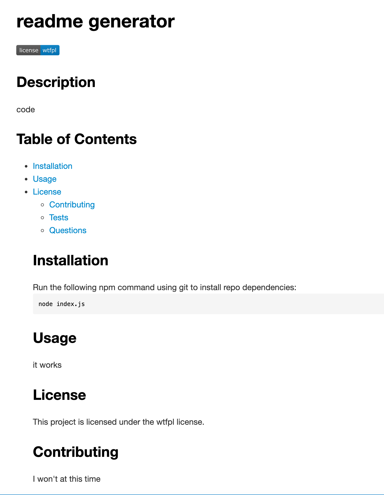

# README Generator
Generate a README.md using answers to prompts using your computer terminal or command window using node index.js command.
## Description 
This application generates README.md files based on what the user inputs. Using 
nmp inquirer, the user will be prompted to answer questions that will create a README.md file for projects includi
ng prompts to add the project title, a brief description, installation instructions, project usage, additions made
to the project as well as tests that can be run, a license for the project, a GitHub username and an email address 
to be contacted for information and or questions.

## Installation

To install the project you will need to install package.json, .git config, etc. to your VS Code after cloning the repository.

## Usage 

Generate a README.md using answers to prompts and data from the environment, like package.json, .git config, etc. This generator can be run by command line if Generate is installed globally, or you can use this as a plugin or sub-generator in your own generator.


```md

```
Screencastify Tutorial Video Walkthrough:
 
https://youtu.be/acRG83Rrzaw

## License

The last section of a good README is a license. This lets other developers know what they can and cannot do with your project. If you need help choosing a license, use [https://choosealicense.com/](https://choosealicense.com/)


🏆 The sections listed above are the minimum for a good README, but your project will ultimately determine the content of this document. You might also want to consider adding the following sections.

## Badges


Badges aren't _necessary_, per se, but they demonstrate street cred. Badges let other developers know that you know what you're doing. Check out the badges hosted by [shields.io](https://shields.io/). You may not understand what they all represent now, but you will in time.


## Features

If your project has a lot of features, consider adding a heading called "Features" and listing them there.


## Contributing

If you created an application or package and would like other developers to contribute it, you will want to add guidelines for how to do so. The [Contributor Covenant](https://www.contributor-covenant.org/) is an industry standard, but you can always write your own.